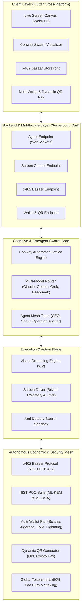

# Qmoosa Bot - Scientific & Technical Master Architecture

```
██████╗ ███╗   ███╗ ██████╗  ██████╗ ███████╗ █████╗     ██████╗  ██████╗ ████████╗
██╔═══██╗████╗ ████║██╔═══██╗██╔═══██╗██╔════╝██╔══██╗    ██╔══██╗██╔═══██╗╚══██╔══╝
██║   ██║██╔████╔██║██║   ██║██║   ██║███████╗███████║    ██████╔╝██║   ██║   ██║   
██║▄▄ ██║██║╚██╔╝██║██║   ██║██║   ██║╚════██║██╔══██║    ██╔══██╗██║   ██║   ██║   
╚██████╔╝██║ ╚═╝ ██║╚██████╔╝╚██████╔╝███████║██║  ██║    ██████╔╝╚██████╔╝   ██║   
 ╚══▀▀═╝ ╚═╝     ╚═╝ ╚═════╝  ╚═════╝ ╚══════╝╚═╝  ╚═╝    ╚═════╝  ╚═════╝    ╚═╝   
```

## Abstract
**Qmoosa Bot** is a next-generation Autonomous Agentic Super-OS engineered to surpass existing closed, single-model solutions (such as xAI Grok Bot). It establishes a decentralized, multi-agent machine capable of full computer screen control, dynamic multi-model routing, post-quantum cryptography, emergent cellular automata task scheduling, native HTTP 402 micro-settlements, and multi-wallet fiat/crypto rails with dynamic QR facilities.

---

## The 9 Architectural Pillars



---

### Pillar 1: Conway Automaton Workflow Engine
- **Mathematical Foundation:** Two-dimensional cellular automaton grid ($\mathbb{Z}_N \times \mathbb{Z}_N$) executing adapted Conway evolutionary rules:
  $$\text{State}(x, y)_{t+1} = f(\text{State}(x, y)_t, \sum \mathcal{N}(x, y))$$
- **Self-Healing Fault Tolerance:** Dead cells surrounded by 3 active neighboring worker agents automatically trigger worker rebirth.
- **Dynamic Task Decomposition:** Overcrowded cells ($>3$ collaborators) mutate and spawn sub-workers in empty neighboring slots, eliminating pipeline bottlenecks.

### Pillar 2: Multi-Model AI Routing Mesh
- **Specialized Allocation:**
  - `claude-3-7-sonnet`: OS Computer Use, code synthesis, complex GUI decisions.
  - `gemini-2.5-flash`: Massive multimodal screen frame analysis, video streams.
  - `grok-3-osint`: Real-time X/Twitter data and open-source intelligence.
  - `deepseek-r1-local`: Zero-cost edge reasoning, confidential key parsing.
- **Failover:** Automatic routing to alternate models on rate limits or service interruptions.

### Pillar 3: Collaborative Agent Mesh
- **Hierarchical Swarm:**
  - **CEO Orchestrator:** Mission scoping, resource allocation.
  - **Scout / OSINT:** High-intent lead extraction and intent detection.
  - **Screen Operator:** Virtual mouse/keyboard navigation.
  - **x402 Auditor:** Cryptographic proof verification and audit notarization.

### Pillar 4: Full Computer Screen Controller
- **Bézier Trajectory Generator:** Simulates human mouse movement using cubic Bézier curves:
  $$B(t) = (1-t)^3 P_0 + 3(1-t)^2 t P_1 + 3(1-t) t^2 P_2 + t^3 P_3, \quad t \in [0, 1]$$
- **Gaussian Keystroke Jitter:** Eliminates robotic typing patterns, bypassing advanced anti-bot heuristics.
- **Visual Grounding Engine:** Calibrates pixel coordinates from natural language element queries.

### Pillar 5: x402 Bazaar Protocol (Autonomous M2M Economy)
- **RFC HTTP 402 Implementation:** Enables autonomous agent-to-agent procurement of micro-services (CAPTCHA bypass, contact verification, deep search).
- **Challenge Nonces & Replay Guard:** Time-bounded cryptographic challenge strings prevent replay attacks.
- **Autonomous Escrow State Machine:** Funds locked on-chain until SHA-256 evidence is committed.

### Pillar 6: Post-Quantum Cryptography (PQC) & Key Vault
- **NIST FIPS 203 (ML-KEM / Kyber):** Lattice-based Key Encapsulation Mechanism for shared secrets.
- **NIST FIPS 204 (ML-DSA / Dilithium):** Quantum-resistant digital signatures for agent action audit logs.
- **Zero-Knowledge Key Vault:** Encrypted credential storage for API keys and blockchain seeds.

### Pillar 7: Multi-Wallet Rails & Dynamic QR Engine
- **Crypto Rails:** Algorand MainNet (AVM v8), Solana (Solana Pay), EVM (Base/Arbitrum), Bitcoin Lightning (BOLT-11).
- **Fiat Rails:** NPCI UPI Dynamic QR engine, SEPA, Stripe Connect.
- **Dynamic QR Generator:** Generates standardized deep-link URIs and embedded SVG representations for instant mobile scan-to-pay.

### Pillar 8: Global Tokenomics & Deflationary Mechanics
- **Burn-on-Execution:** 50% of all x402 microservice fees are permanently burned on-chain.
- **Staking Tiers:** Staking \$QMOOSA / \$QALGO unlocks higher swarm concurrency and prioritized Claude 3.7 access.
- **Proof-of-Resolution (PoR):** Algorithmic reward minting for high-complexity problem solving.

### Pillar 9: Serverpod Backend & Flutter Client
- **Serverpod (Dart):** Real-time WebSockets, streaming thought logs, low-latency RPC endpoints.
- **Flutter:** Single codebase cross-platform dashboard (Windows, macOS, Linux, Web, Android, iOS) with interactive remote desktop canvas and 1-click human takeover.
